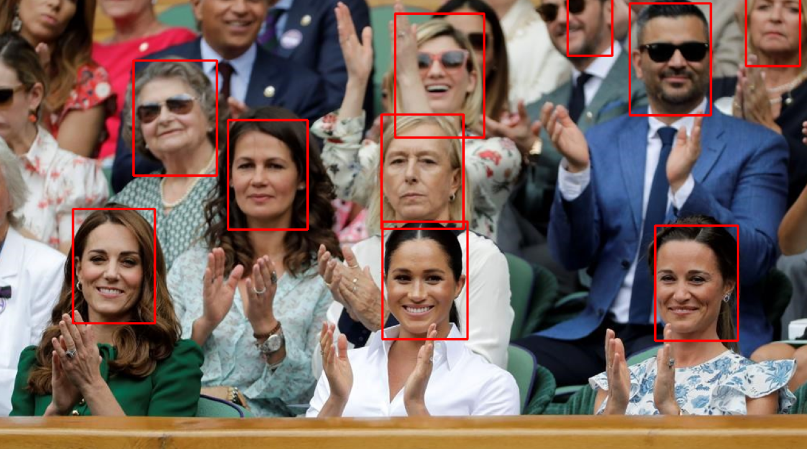
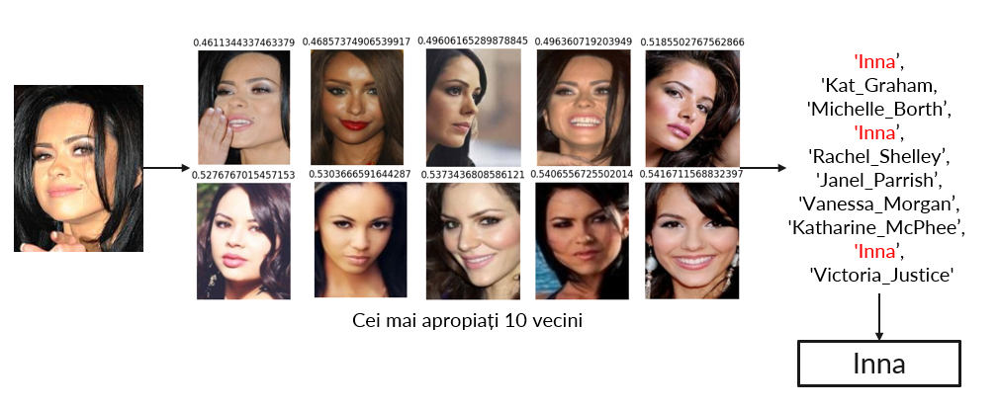
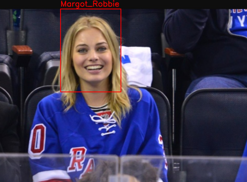
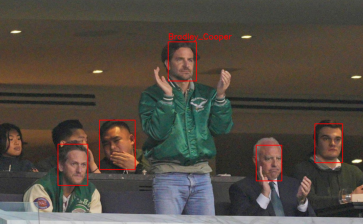
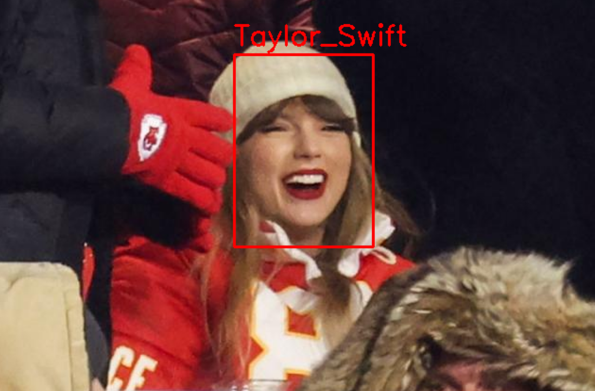
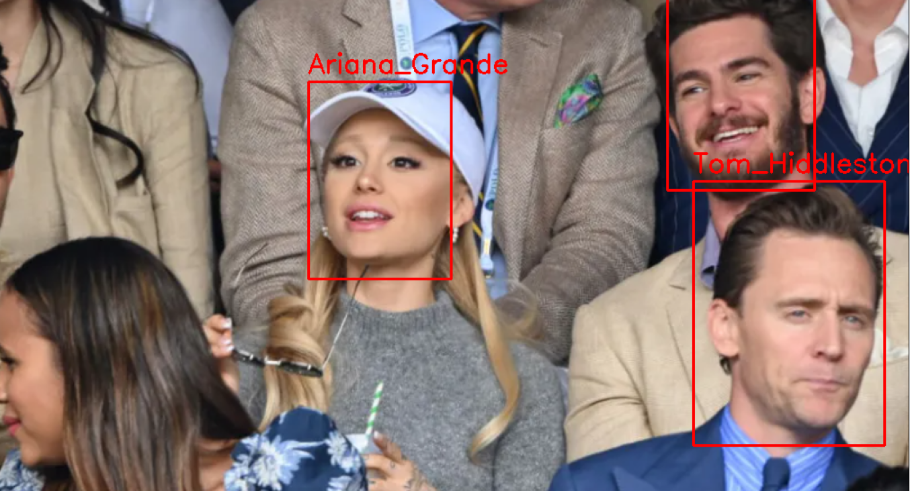

# Celebrity Face Recognition in Sports Videos

This project is a facial recognition application designed to process videos and identify celebrities appearing in the stands during sports events. The application was developed using Python, with two neural networks trained to detect faces and classify them based on facial features. These functionalities are integrated into an optimized video processing app with an HTML/CSS interface.

## Table of Contents
- [General Description](#general-description)
- [Faster R-CNN for Face Detection](#faster-r-cnn-for-face-detection)
- [FaceNet with Inception for Face Recognition](#facenet-with-inception-for-face-recognition)
- [Final Results](#final-results)

## General Description

The application processes sports videos to identify celebrities in the audience. It uses advanced machine learning techniques, specifically Faster R-CNN for face detection and FaceNet with Inception for face recognition. The results are displayed with an easy-to-use HTML/CSS interface.

## Faster R-CNN for Face Detection

Faster R-CNN is utilized in this project to detect faces in video frames. Faster R-CNN is an object detection framework that employs a Region Proposal Network (RPN) to efficiently generate region proposals which are then used for detection.

### Face Detection Results

## FaceNet with Inception for Face Recognition

FaceNet, combined with the Inception architecture, is used for face recognition. This network maps facial features into a Euclidean space such that the distance between embeddings corresponds to a measure of face similarity. For this project, FaceNet was used to perform a 10-nearest neighbors search to identify celebrities.

### 10-NN Search Results

## Final Results

The final results show the successful detection and recognition of celebrities in the sports videos. Below are some sample frames from the processed videos:

  
  

  
  

  

The project demonstrates the effectiveness of combining Faster R-CNN for face detection with FaceNet for face recognition, providing accurate and reliable results in identifying celebrities in dynamic video content.

## Conclusion

This project highlights the potential of deep learning techniques in enhancing the viewer experience in sports broadcasting. By accurately identifying and recognizing celebrities in the audience, broadcasters can provide more engaging and interactive content to viewers.
